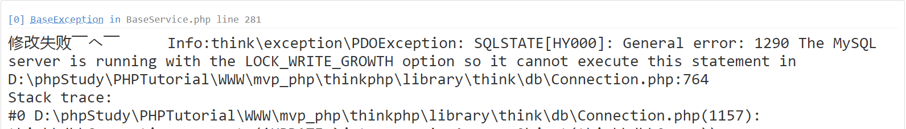

**1、GROUP BY 理解**

**2、记录一个MySQL异常**

2019年10月9日，人工审核遇到一个BUG，如下图：

（框架是ThinkPHP5.1），异常中的主要部分==LOCK_WRITE_GROWTH==参数在检索后没有查询到产生异常的原因，试着在代码里面查询出问题，后面检查出有个库的新增和修改都会报错（使用heidisql数据库管理工具直接修改）

提交到运维处后是数据库已满

解决办法：数据库升级（增加空间），再重启