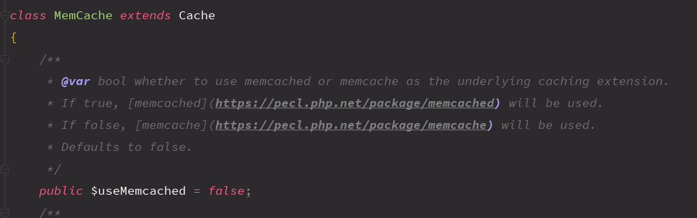

## Yii2.0 控制器中behaviors和actions的方法

控制器中使用 behaviors() 在方法执行前 使用指定的验证器 进行处理数据

```php
public function behaviors() {
    return [
        'access' => [
            'class' => AccessControl::className(), // 使用核心过滤器Access 对执行动作进行验证
            'only' => ['logout'], // 对logout动作进行验证
            'rules' => [ // 规则
                [
                    'actions' => ['logout'],
                    'allow' => true, // 只允许认证用户进行访问
                    'roles' => ['@'],
                ],
            ],
        ],
        'verbs' => [ // 设置curd动作 所运行的请求方式
            'class' => VerbFilter::className(),
            'actions' => [
                'logout' => ['post'], // post 方法
            ],
        ],
   ];
}
```

actions的理解

比如在 site/test 的时候，会先在actions方法中找对应请求的 test 方法，如果没有那么就会在控制器中找actionTest。 

还有就是把公共的方法放在actions()中，这样对应要调用一些公共的静态页面的时候就可以不用谢控制器方法了。

```php
public function actions() {
    return [
        'error' => [
            'class' => 'yii\web\ErrorAction',
        ],
        'captcha' => [
            'class' => 'yii\captcha\CaptchaAction',
            'fixedVerifyCode' => YII_ENV_TEST ? 'testme' : null,
        ],
       //返回验证
        'tests'=>[
             'class'=>'backend\models\TestAction',
         ]
    ];
}
```


## Yii2使用缓存

[参考文档01](https://www.yiichina.com/doc/guide/2.0/caching-data)

[参考文档02](https://www.yiiframework.com/doc/guide/2.0/zh-cn/caching-data)

### 文件缓存Cache

使用标准文件存储缓存数据。 这个特别适用于缓存大块数据，例如一个整页的内容。

配置如下：

```php
		'cache' => [
            'class' => 'yii\caching\FileCache',
        ],
```


使用：


### MemCache缓存

使用 PHP `memcache` 和 `memcached` 扩展

配置如下：

```php
		'memcache' => [
            // memcache使用FileCache文件缓存
            'class' => 'yii\caching\FileCache',
            'keyPrefix' => 'memcache',       // 唯一键前缀，只能使用字母和数字
        ],
        'memcached' => [
            // memcached使用MemCache服务缓存
            'class' => 'yii\caching\MemCache',
            'servers' => [
                [
                    'host' => 'server1',
                    'port' => 11211,
                    'weight' => 60,
                ],
                [
                    'host' => 'server2',
                    'port' => 11211,
                    'weight' => 40,
                ],
            ],
            'useMemcached' => true ,
        ],
```

针对最后一个参数`useMemcached`



使用：

```php
		$name = 'SYS_USER_INFO_' . $id;
        // $data 代表查询获取到的数据
        $data = [
            'id' => $id,
            'name' => 'Eachone',
            'sex' => '男',
            'tel' => '18982723863',
        ];
        /**
         * @var $cache CacheInterface
         */
        $cache = Yii::$app->memcache;
        if (!$cacheData = $cache->get($name)) {
            $cacheData = $data;
            $cache->set($name, $data, 3600);
        }
        print_r($cacheData);
```


## 发送请求HttpClient类

[参考文档01](https://www.yiiframework.com/extension/yiisoft/yii2-httpclient/doc/guide/2.0/zh-cn/installation)

`composer require --prefer-dist yiisoft/yii2-httpclient "*"`

基于 Yii 2 的 HTTP 客户端扩展

使用：

```php
use yii\httpclient\Client;

$client = new Client();
$response = $client->createRequest()
    ->setMethod('POST')
    ->setUrl('http://example.com/api/1.0/users')
    ->setData(['name' => 'John Doe', 'email' => 'johndoe@example.com'])
    ->send();
if ($response->isOk) {
    $newUserId = $response->data['id'];
}
```


## Yii2按需加载并管理CSS样式/JS脚本


## Yii2数据提供者

[参考文档01](https://www.yiiframework.com/doc/guide/2.0/zh-cn/output-data-providers)

[参考文档02](https://www.yiiframework.com/doc/guide/2.0/zh-cn/output-data-widgets#shu-ju-guo-lu)


## Yii2数据小部件

### DetailView


### ListView


### GridView


## 问题：Yii2中Model->load()后属性还是为null

` $model->load()`：用输入数据填充模型

原因：对应的models中没有设置rules规则


## Yii2队列

什么是消息队列：


相关命令：

```shell
yii queue/listen 5 //表示每隔5s监听一次队列
yii queue/run 运行队列任务直到空，一般用于定时cron
yii queue/info 查看队列状态
```

创建了队列一定要用`yii queue/listen`或者`yii queue/run`,前者是yii监听，后者一般用于**worker**和**Cron**

问题：

版本2.0.29

配置完成后，不修改`path`配置参数是默认值时，生成的index.data文件和jobXXX.data文件会在当前模块下，这是队列并不会生效。只有将`path`修改为

```php
'path' => '@console/runtime/queue',
```

后，index.data文件和jobXXX.data文件会生成到console/runtime/queue文件夹下，测试队列生效。为什么在当前模块下的queue不生效？

参考资料：[阿北](https://segmentfault.com/a/1190000013203346)、[掘金](https://juejin.im/post/5aa770546fb9a028bd4bfbdf)、[文档](https://www.yiiframework.com/extension/yiisoft/yii2-queue/doc/guide/2.0/zh-cn/usage)

------

配置：


部分代码：

------


```php
	public function actionDownload()
    {
        /**
         * @var $queue Queue
         */
        $queue = Yii::$app->queue;
        $queue->delay(30)->push(new DownloadJob([
            'url' => 'https://desk-fd.zol-img.com.cn/t_s960x600c5/g2/M00/05/04/ChMlWV3BTXiIOr1AAAcLBm5BtJoAANKrAAJirwABwse999.jpg',
            'file' => 'avatars.jpeg',
        ]));

        echo '下载成功';
    }
```


------


```php
<?php


namespace common\jobs;


use yii\base\BaseObject;
use yii\queue\JobInterface;

class DownloadJob extends BaseObject implements JobInterface
{
    public $url;

    public $file;

    public function execute($queue)
    {
        // TODO: Implement execute() method.
        file_put_contents($this->file, file_get_contents($this->url));
    }
}
```


## Yii2中事务的使用

[参考资料01](https://www.yiiframework.com/doc/guide/2.0/zh-cn/db-dao)

```php
// 创建事务
$transaction = Yii::$app->db->beginTransaction();
try {
    if(!$model->save()) {
        return ...;
    }
    ...
    // 提交事务
    $transaction->commit();
} catch (\Exception $e) {
    // 回滚事务
    $transaction->rollBack();
    throw $e;
}

// 或
    
$db = Yii::$app->db;
$transaction = $db->beginTransaction();
try {
    $db->createCommand($sql1)->execute();
    $db->createCommand($sql2)->execute();
    // ... executing other SQL statements ...
    
    $transaction->commit();
} catch(\Exception $e) {
    $transaction->rollBack();
    throw $e;
} catch(\Throwable $e) {
    $transaction->rollBack();
    throw $e;
}
```

