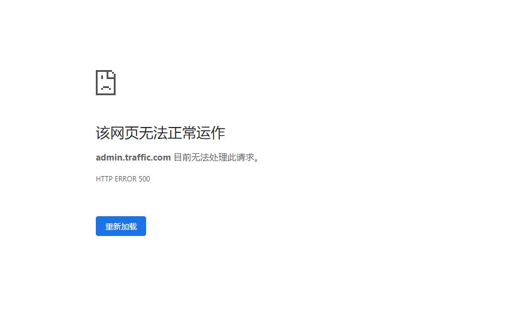
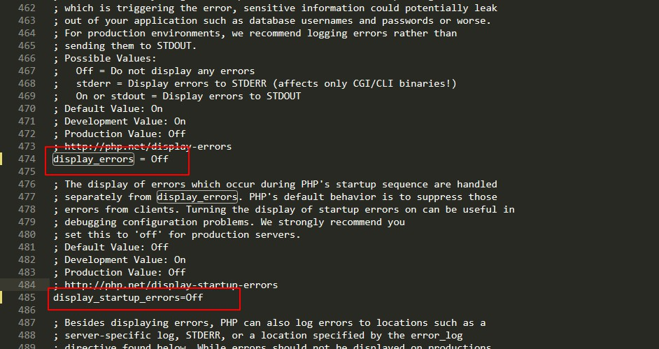

1. php 短信发送库

```
composer require toplan/phpsms:~1.8
```

2. 前后端分离接口规范

` <https://mp.weixin.qq.com/s/1IiRg4NySJ63GoZwZ0tDZA>`

3.  第三方插件集

<https://github.com/logoove/phpclass>

3. 


## 开源项目

1. [CRMEB客户管理+电商营销系统](<https://github.com/crmeb/CRMEB>) 

   基于ThinkPhp5.0+Vue+EasyWeChat 开发的一套CRMEB新零售商城系统

------

2. 


## 开发问题

针对网站开发搭建环境LAMP时，访问出现500服务器错误



解决办法：
由于php.ini配置文件中错误显示关闭导致.

将下值由Off 变更为 On

```ini
#修改你的php.ini文件 
display_errors = On
display_startup_errors = On
```

修改完以后呢重启你的php-fpm，完成。

