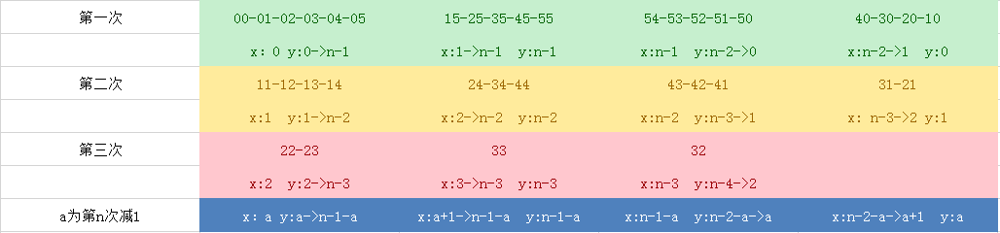

# 力扣刷题记

**2019年9月2日：**[771. 宝石与石头](https://leetcode-cn.com/problems/jewels-and-stones/)  

> 给定字符串J 代表石头中宝石的类型，和字符串 S代表你拥有的石头。 S 中每个字符代表了一种你拥有的石头的类型，你想知道你拥有的石头中有多少是宝石。
> J 中的字母不重复，J 和 S中的所有字符都是字母。字母区分大小写，因此"a"和"A"是不同类型的石头。
>
> 示例 1:
> 输入: J = "aA", S = "aAAbbbb"
> 输出: 3
>
> 示例 2:
> 输入: J = "z", S = "ZZ"
> 输出: 0
>
> 注意:
> S 和 J 最多含有50个字母。
> J 中的字符不重复。

*php版：*

```php
	// 普通
	public function numJewelsInStones($J, $S)
    {
        $number = 0;
        for ($i = 0; $i < strlen($J); $i++) {
            for ($j = 0; $j < strlen($S); $j++) {
                if ($J[$i] === $S[$j]) {
                    $number++;
                }
            }
        }
        return $number;
    }
	// 类似于js的hash
	public function numJewelsInStonesHash($J, $S)
    {
        $number = 0;
        $newJ = array_flip(str_split($J));
        for ($i = 0; $i < strlen($S); $i++) {
            if (isset($newJ[$S[$i]])) {
                $number++;
            }
        }
        return $number;
    }
```

*javascript版：*

```javascript
/**
 * 正则
 * @param {string} J 
 * @param {string} S 
 */
let numJewelsInStonesReg = function (J, S) {
    let newS = S;
    for (let i = 0; i < J.length; i++) {
        newS = newS.replace(new RegExp(J[i], 'g'), "");
    }
    return S.length - newS.length;
};

/**
 * 哈希
 * @param {string} J 
 * @param {string} S 
 */
let numJewelsInStonesHash = function (J, S) {
    let setJedwls = new Set(J);
    let number = 0;
    let len = S.length;
    for (let i = 0; i < len; i++) {
        if (setJedwls.has(S[i])) {
            number++;
        }
    }
    return number;
};
```

*python版：*

```python
def numJewelsInStones(jewels, stones):
    number = 0
    for s in stones:
        if s in jewels:
            number += 1
    return number


def numJewelsInStonesBest(J: str, S: str) -> int:
    return len([i for i in S if i in J])
```

> php的那个hash版是参照js写的，因为php的hash表和javascript的[hash表](https://segmentfault.com/a/1190000007692754)是不大相同的。
>
> python的最简单。

------

**2019年9月3日：[1108. IP 地址无效化](https://leetcode-cn.com/problems/defanging-an-ip-address/)**

> 给你一个有效的 IPv4 地址 address，返回这个 IP 地址的无效化版本。
>
> 所谓无效化 IP 地址，其实就是用 "[.]" 代替了每个 "."。
>
> 
>
> 示例 1：
>
> 输入：address = "1.1.1.1"
> 输出："1[.]1[.]1[.]1"
> 示例 2：
>
> 输入：address = "255.100.50.0"
> 输出："255[.]100[.]50[.]0"
>
>
> 提示：
>
> 给出的 address 是一个有效的 IPv4 地址
>

*PHP版：*

```php
	// 正则
    public function defangIPaddr($address)
    {
        return str_replace('.', '[.]', $address);
    }
	// 循环
    public function defangIPaddrCycle($address)
    {
        $newAddress = str_split($address);
        foreach ($newAddress as &$value) {
            if ($value === '.') {
                $value = '[.]';
            }
        }
        unset($value);
        return implode("", $newAddress);
    }
```

*javascript：*

```javascript
var defangIPaddr = function (address) {
    return address.replace(/\./g, "[.]");
};

var defangIPaddrOne = function (address) {
    return (address.split('.')).join('[.]')
};
```

*python版：*

```python
def defangIPaddr(address: str) -> str:
    return address.replace('.', '[.]')


def defangIPaddrOne(address: str) -> str:
    return '[.]'.join(address.split('.'))
```

>三个版本其实都可以用正则解决此问题

------

**2019年9月4日：[1021. 删除最外层的括号](https://leetcode-cn.com/problems/remove-outermost-parentheses/)**

> 有效括号字符串为空 ("")、"(" + A + ")" 或 A + B，其中 A 和 B 都是有效的括号字符串，+ 代表字符串的连接。例如，""，"()"，"(())()" 和 "(()(()))" 都是有效的括号字符串。
>
> 如果有效字符串 S 非空，且不存在将其拆分为 S = A+B 的方法，我们称其为原语（primitive），其中 A 和 B 都是非空有效括号字符串。
>
> 给出一个非空有效字符串 S，考虑将其进行原语化分解，使得：S = P_1 + P_2 + ... + P_k，其中 P_i 是有效括号字符串原语。
>
> 对 S 进行原语化分解，删除分解中每个原语字符串的最外层括号，返回 S 。
>
>  
>
> 示例 1：
>
> 输入："(()())(())"
>
> 输出："()()()"
>
> 解释：
>
> 输入字符串为 "(()())(())"，原语化分解得到 "(()())" + "(())"，
>
> 删除每个部分中的最外层括号后得到 "()()" + "()" = "()()()"。
>
> 示例 2：
>
> 输入："(()())(())(()(()))"
>
> 输出："()()()()(())"
>
> 解释：
>
> 输入字符串为 "(()())(())(()(()))"，原语化分解得到 "(()())" + "(())" + "(()(()))"，
>
> 删除每隔部分中的最外层括号后得到 "()()" + "()" + "()(())" = "()()()()(())"。
>
> 示例 3：
>
> 输入："()()"
>
> 输出：""
>
> 解释：
>
> 输入字符串为 "()()"，原语化分解得到 "()" + "()"，
>
> 删除每个部分中的最外层括号后得到 "" + "" = ""。
>
>  
>
> 提示：
>
> S.length <= 10000
>
> S[i] 为 "(" 或 ")"
>
> S 是一个有效括号字符串

*PHP版：*

```php
	// 此方法没有看见  *S 是一个有效括号字符串* 这个条件
    public function removeOuterParentheses($S) {
        $left = [];
        $right = [
            -1=>0,
        ];
        for ($i=0; $i < strlen($S); $i++) { 
            if ($S[$i] === '(') {
                if ((1 + $right[$i-1]+1) > 2) {
                    $left[$i] = 1;
                }else{
                    $left[$i] = 0;
                }
                $right[$i] = $right[$i-1]+1;
            }else{
                if ((2 + $right[$i-1]-1) > 2) {
                    $left[$i] = 1;
                }else{
                    $left[$i] = 0;
                }
                $right[$i] = $right[$i-1]-1;
            }
        }

        $newS = [];
        foreach($left as $key=>$value){
            if ($value == 1) {
                $newS[] = $S[$key];
            }
        }

        return implode('',$newS);
    }

    public function removeOuterParenthesesBest($S){
        $number = 0;
        $newS = '';
        for ($i=0; $i < strlen($S); $i++) { 
            if ($S[$i] === '(') {
                if ($number > 0) {
                    $newS .= $S[$i];
                }
                $number++;
            }else{
                $number--;
                if ($number > 0) {
                    $newS .= $S[$i];
                }
            }
        }
        return $newS;
    }
```

*javascript版：*

```javascript
var removeOuterParentheses = function (S) {
    let answer = ''
    let height = 0
    for (const char of S) {
        let isLeft = char === '('
        if (isLeft) {
            height += 1
        } else {
            height -= 1
        }
        if ((isLeft && height === 1) || (!isLeft && height === 0)) {
        } else {
            answer += char
        }
    }
    return answer
};
```

*python版：*

```python
	def removeOuterParentheses(self, S: str) -> str:
        l = 0
        res = ''
        for c in S:
            if c == '(':
                l += 1
                if l > 1:
                    res += c
            else:
                if l > 1:
                    res += c
                l -= 1
        return res
```

> 后记：其实三个版本都是大同小异，思路大致的都是：设置一个计数器 `count`，左括号 `+1`，右括号减 `1`，等于 `0` 则找到外括号的终点。并且 `0` 后面的一个括号肯定也是外括号，可以直接跳过。

*java版：*

```java
	public String removeOuterParentheses(String S) {
        StringBuilder ans = new StringBuilder();
        Stack<Character> stack = new Stack<>();

        int start = 0;// 初始化原语的起始位置
        int end = 0;// 初始化原语的结束位置
        boolean flag = false;// 标志每个原语

        for (int i = 0;i < S.length();i++) {
            char ch = S.charAt(i);

            if (ch == '(') {// 遇到左括号，入栈
                stack.push(ch);
                if (!flag) {// 遇到的第一个左括号，是原语的开始位置，记录下原语开始位置
                    start = i;
                    flag = true;
                }
            }

            if (ch == ')') {// 遇到右括号，出栈
                stack.pop();
                if (stack.isEmpty()) {// 当栈空的时候，找到了一个完整的原语
                    end = i;// 记录下结束位置
                    ans.append(S.substring(start + 1,end));// 去掉原语的最外层括号，并追加到答案中
                    flag = false;// 置标志为false，往后接着找下一个原语
                    start = end;// 往后找，再次初始化原语开始位置
                }
            }
        }

        return ans.toString();
    }


	// 简化版
	public String removeOuterParentheses(String S) {
        Stack<Character> stack = new Stack<>();
        StringBuilder sb = new StringBuilder();
        int start = 0;
        for(int i = 0; i < S.length(); i++){
            if(S.charAt(i) == '('){
                stack.push('(');
            }else{
                stack.pop();
                if(stack.isEmpty()){
                    sb.append(S.substring(start + 1, i));
                    start = i + 1;
                }
            }
        }
        return sb.toString();
    }
```

------

**2019年9月5日：[709. 转换成小写字母](https://leetcode-cn.com/problems/to-lower-case/)**

> 实现函数 ToLowerCase()，该函数接收一个字符串参数 str，并将该字符串中的大写字母转换成小写字母，之后返回新的字符串。 
>
> 示例 1：
>
> 输入: "Hello"
> 输出: "hello"
>
> 示例 2：
>
> 输入: "here"
> 输出: "here"
>
> 示例 3：
>
> 输入: "LOVELY"
> 输出: "lovely"

*php版：*

```php
	public function toLowerCase($str) {
        $newStr = '';
        $count = strlen($str);
        for ($i=0; $i < $count; $i++) { 
            $ascii = ord($str[$i]);
            if ($ascii >= 65 && $ascii <= 90) {
                $newStr .= chr($ascii + 32);
            }else{
                $newStr .= $str[$i];
            }
        }
        return $newStr;
    }
```

*javascript版:*

```javascript
	let newStr = '';
    let len = str.length;
    for (let index = 0; index < len; index++) {
        let ascii = str[index].charCodeAt();
        if (ascii >= 65 && ascii <= 90) {
            newStr += String.fromCharCode(ascii + 32);
        } else {
            newStr += str[index];
        }
    }

    return newStr;
```

*python版：*

```python
def toLowerCase(str: str) -> str:
    return ''.join([chr(ord(s) + 32) if ord(s) >=65 and ord(s) <= 90 else s for s in str])
```

> 三个版本在不借助函数的情况下，都是有转化ASCII码这个步骤，其中python和PHP的方法类似

------

**2019年9月25日:[950. 按递增顺序显示卡牌](https://leetcode-cn.com/problems/reveal-cards-in-increasing-order/)**

> 牌组中的每张卡牌都对应有一个唯一的整数。你可以按你想要的顺序对这套卡片进行排序。
>
> 最初，这些卡牌在牌组里是正面朝下的（即，未显示状态）。
>
> 现在，重复执行以下步骤，直到显示所有卡牌为止：
>
> 从牌组顶部抽一张牌，显示它，然后将其从牌组中移出。
> 如果牌组中仍有牌，则将下一张处于牌组顶部的牌放在牌组的底部。
> 如果仍有未显示的牌，那么返回步骤 1。否则，停止行动。
> 返回能以递增顺序显示卡牌的牌组顺序。
>
> 答案中的第一张牌被认为处于牌堆顶部。
>
>  
>
> 示例：
>
> 输入：[17,13,11,2,3,5,7]
> 输出：[2,13,3,11,5,17,7]
> 解释：
> 我们得到的牌组顺序为 [17,13,11,2,3,5,7]（这个顺序不重要），然后将其重新排序。
> 重新排序后，牌组以 [2,13,3,11,5,17,7] 开始，其中 2 位于牌组的顶部。
> 我们显示 2，然后将 13 移到底部。牌组现在是 [3,11,5,17,7,13]。
> 我们显示 3，并将 11 移到底部。牌组现在是 [5,17,7,13,11]。
> 我们显示 5，然后将 17 移到底部。牌组现在是 [7,13,11,17]。
> 我们显示 7，并将 13 移到底部。牌组现在是 [11,17,13]。
> 我们显示 11，然后将 17 移到底部。牌组现在是 [13,17]。
> 我们展示 13，然后将 17 移到底部。牌组现在是 [17]。
> 我们显示 17。
> 由于所有卡片都是按递增顺序排列显示的，所以答案是正确的。
>
>
> 提示：
>
> 1 <= A.length <= 1000
> 1 <= A[i] <= 10^6
> 对于所有的 i != j，A[i] != A[j]

*思路分析：*

> 关键点在于示例的理解，示例已经给出了详细的步骤
>
> 首先先将原数组按照升（降）序排列，得到[2,3,5,7,11,13,17]，以$count大于0循环，每一次循环先将原数组的最大值弹出，保存到新数组的最右边，然后再将新数组的第一个值放到最后，循环结束后返回单元顺序相反的数组
>
> 大致流程：
>
> 第一次，我们选17，[17]->[17]
>
> 第二次，我们选13，[17, 13]->[13, 17]
>
> 第三次，我们选11，[13, 17, 11]->[17, 11, 13]
>
> 第四次，我们选 7，[17, 11, 13, 7]->[11, 13, 7, 17]
>
> 第五次，我们选 5，[11, 13, 7, 17, 5]->[13, 7, 17, 5, 11]
>
> 第六次，我们选 3，[13, 7, 17, 5, 11, 3]->[7, 17, 5, 11, 3, 13]
>
> 第七次，我们选 2，[7, 17, 5, 11, 3, 13, 2]。此时数组中所有元素都在队列中，过程结束。我们需要将这个队列倒过来

*php版：*

```php
public function deckRevealedIncreasing($deck) {
	$newDeck = [];
        
    $numbers = count($deck);
    sort($deck);
        
    while ($numbers > 0) {
        $tempValue1 = array_pop($deck);
        array_push($newDeck,$tempValue1);

        $tempValue2 = array_shift($newDeck);
        array_push($newDeck,$tempValue2);
            
        $numbers--;
    }
        
    array_unshift($newDeck,array_pop($newDeck));
    return array_reverse($newDeck);
}
```

**2019年9月26日:[59. 螺旋矩阵 II](https://leetcode-cn.com/problems/spiral-matrix-ii/)**

> 给定一个正整数 n，生成一个包含 1 到 n^2^ 所有元素，且元素按顺时针顺序螺旋排列的正方形矩阵。
>
> 示例:
>
> 输入: 3
> 输出:
> [
>  [ 1, 2, 3 ],
>  [ 8, 9, 4 ],
>  [ 7, 6, 5 ]
> ]

*思路分析：*

结构展示图


分析：



*PHP版：*

```php
	function generateMatrix($n) {
        $arr = array_fill(0, $n, array_fill(0, $n, 0));
        $fillArr = range(1,pow($n,2));
        
        $isLoop = true;
        $a= 0;
        while ($isLoop) {
            // right
            // x:0  y:0~n-1
            // x:a  y:a~n-1-a
            for ($i=$a; $i <= $n - 1 - $a; $i++) { 
                $arr[$a][$i] = array_shift($fillArr);
            }
            if (count($fillArr) === 0) {
                $isLoop = false;
                break;
            }

            // down
            // x:1~n-1  y:n-1
            // x:a+1~n-1-a  y:n-1-a
            for ($i=$a + 1; $i <= $n - 1 - $a; $i++) { 
                $arr[$i][$n-1-$a] = array_shift($fillArr);
            }
            if (count($fillArr) === 0) {
                $isLoop = false;
                break;
            }

            // left
            // x:n-1  y:n-2~0
            // x:n-1-a  y:n-2-a~a
            for ($i=$n-2 - $a; $i >= $a; $i--) { 
                $arr[$n-1-$a][$i] = array_shift($fillArr);
            }
            if (count($fillArr) === 0) {
                $isLoop = false;
                break;
            }
            
            
            // up
            // x:n-2~1  y:0
            // x:n-2-a~a+1  y:a
            for ($i=$n-2-$a; $i >= $a+1; $i--) { 
                $arr[$i][$a] = array_shift($fillArr);
            }
            if (count($fillArr) === 0) {
                $isLoop = false;
                break;
            }
            
            $a++;
        }

        return $arr;
    }
```

php版存在优化问题

------

**2019年9月27日:[78. 子集](https://leetcode-cn.com/problems/subsets/)**

> 给定一组不含重复元素的整数数组 nums，返回该数组所有可能的子集（幂集）。
>
> 说明：解集不能包含重复的子集。
>
> 示例:
>
> 输入: nums = [1,2,3]
> 输出:
>
> ```php
> [
>   [3],
>   [1],
>   [2],
>   [1,2,3],
>   [1,3],
>   [2,3],
>   [1,2],
>   []
> ]
> ```

*思路分析：*

引用[唐炜依](https://leetcode-cn.com/problems/subsets/solution/liang-chong-fang-fa-qiu-jie-zi-ji-by-tangzixia/)

> 考虑层序遍历求解，每次加入一个元素就扩充res的长度，直到所有元素添加完毕。


*PHP版：*

```php
	function subsets($nums)
    {
        $len = count($nums);
        if ($len == 0) {
            return [];
        }
        $newArr = [[],];
        for ($i = 0; $i < $len; $i++) {
            $temp = $nums[$i];
            array_push($newArr, [$temp]);
            $size = count($newArr);
            for ($j = 1; $j < $size; $j++) {
                if ($newArr[$j][0] !== $temp) {
                    $tempArr = $newArr[$j];
                    $tempArr[] = $temp;
                    array_push($newArr, $tempArr);
                }
            }
        }
        return $newArr;
    }
```

思考时间花了两个小时，最后还是看了这个图解做出来的

