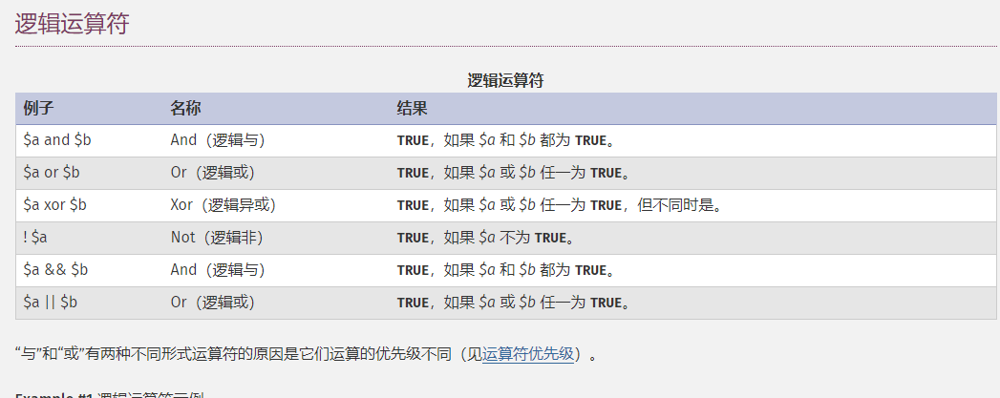

## 读《C陷阱与缺陷》

时间：2020-3-7 20:00

#### 1、`&` 和 `|` 不同于`&&` 和`||`

按位运算符（`&` 和 `|`） 和 逻辑运算符（`&&` 和`||`），

以php为例：

位运算：

逻辑运算：

------

> 这里主要区分的是 `&` 和 `|` 不同于`&&` 和`||`。最好的区别办法就是和python一个思想，用`and`和`or`来替换，
>
> 这个可以在今后的工作中变化。

#### 2、关于运算符优先级的问题

有时看面试题的时候会看见里面出现考面试者关于运算符优先级的问题，我是经常记不住这类知识，比如书里面的`a+++++b`的含义😂😂😂[手动狗头]。自己一想到工作中就算出现了我也会写括号的标识过程

#### 3、

